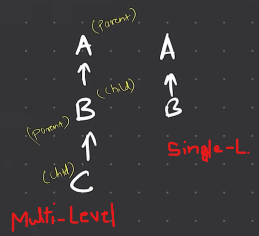
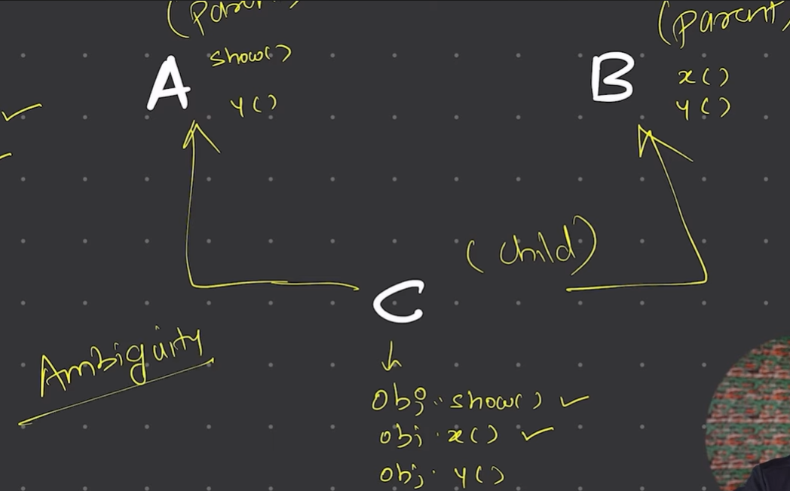

## Inheritance
one class is allowed to inherit the features(fields and methods) of another class.  
The new class that is created is known as subclass (child or derived class) and  

the existing class from where the child class is derived is known as superclass (parent or base class).

```java
public class Calculator {                               //Parent class
    public int add(int a, int b){
        return a+b;
    }
    public int sub(int a, int b){
        return a-b;
    }
}
```

Using Calc methods :
```java
public class Demo {
    public static void main(String[] args) {
        Calculator obj  =  new Calculator();
        System.out.println("Addition : " + obj.add(5,3));
        System.out.println("Subtraction : " + obj.sub(5,3));
    }
}

```
But what if we need to update Calculator class and add more functions like Multiplication and Division? 

-Here comes the concept of Inheritance
```java
public class AdvCalculator extends Calculator{               //Child Class
    public int multiply(int a, int b){
        return a*b;
    }
    public int divide(int a, int b){
        return a/b;
    }
}
```
```java
public class Inheritance {
    public static void main(String[] args) {
        //Using AdvClass which inherits/extends  Calculator class :
        AdvCalculator obj  =  new AdvCalculator();
        System.out.println("Addition : " + obj.add(5,3));
        System.out.println("Subtraction : " + obj.sub(5,3));
        System.out.println("Multiplication : " + obj.multiply(5,3) );
        System.out.println("Division : " + obj.divide(5,3) );
    }
}
```
Types Of Inheritance
1. Single Level
2. Multi Level
3. Hierarchical 



> Multiple Inheritance does not exist. If we try `class C extends A,B` or `class C extends A extends B` it will not work. 
> As it will create an Ambiguity Problem



In Hierarchical : Multiple subclasses inherit from a single parent class.
```java
class A { }
class B extends A { }
class C extends A { }
```
